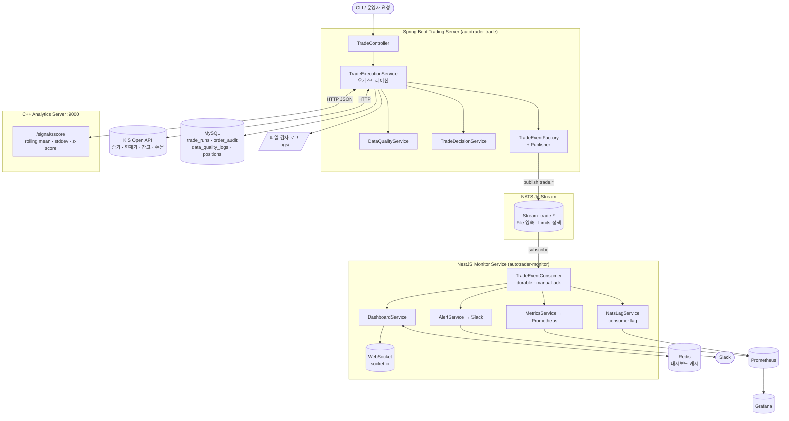
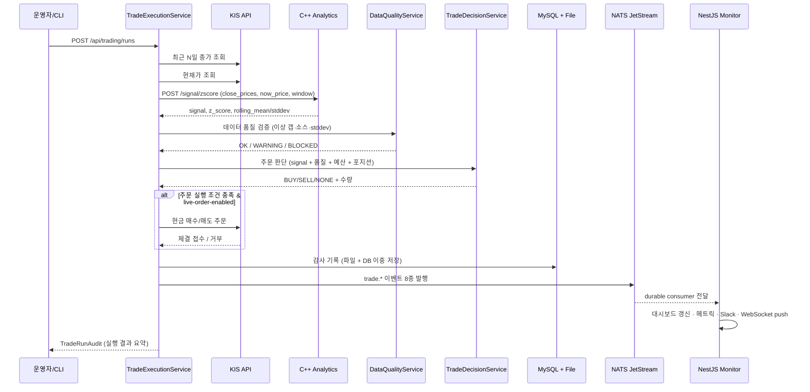

# AutoTrader Service

## 시스템 디자인

```mermaid
flowchart TB
    Operator([CLI / 운영자 요청])

    subgraph Trade["Spring Boot Trading Server (autotrader-trade)"]
        direction TB
        TC[TradeController]
        TES[TradeExecutionService<br/>오케스트레이션]
        DQ[DataQualityService]
        TDS[TradeDecisionService]
        EVT[TradeEventFactory<br/>+ Publisher]
        TC --> TES
        TES --> DQ
        TES --> TDS
        TES --> EVT
    end

    subgraph Cpp["C++ Analytics Server :9000"]
        ZS["/signal/zscore<br/>rolling mean · stddev · z-score"]
    end

    KIS[(KIS Open API<br/>종가 · 현재가 · 잔고 · 주문)]
    DB[(MySQL<br/>trade_runs · order_audit<br/>data_quality_logs · positions)]
    FILE[/파일 감사 로그<br/>logs//]

    subgraph NATS["NATS JetStream"]
        STREAM[("Stream: trade.*<br/>File 영속 · Limits 정책")]
    end

    subgraph Monitor["NestJS Monitor Service (autotrader-monitor)"]
        direction TB
        CONS[TradeEventConsumer<br/>durable · manual ack]
        DASH[DashboardService]
        ALERT[AlertService → Slack]
        METRICS[MetricsService → Prometheus]
        LAG[NatsLagService<br/>consumer lag]
        WS[(WebSocket<br/>socket.io)]
        CONS --> DASH
        CONS --> ALERT
        CONS --> METRICS
        CONS --> LAG
        DASH --> WS
    end

    REDIS[(Redis<br/>대시보드 캐시)]
    PROM[(Prometheus)]
    GRAF[(Grafana)]
    SLACK([Slack])

    Operator --> TC
    TES <-->|HTTP| KIS
    TES <-->|HTTP JSON| ZS
    TES --> DB
    TES --> FILE
    EVT -->|publish trade.*| STREAM
    STREAM -->|subscribe| CONS
    DASH <--> REDIS
    ALERT --> SLACK
    METRICS --> PROM
    PROM --> GRAF
    LAG --> PROM
```

---

## 거래 1회 실행 시퀀스

```mermaid
sequenceDiagram
    participant U as 운영자/CLI
    participant S as TradeExecutionService
    participant K as KIS API
    participant C as C++ Analytics
    participant Q as DataQualityService
    participant D as TradeDecisionService
    participant DB as MySQL + File
    participant N as NATS JetStream
    participant M as NestJS Monitor

    U->>S: POST /api/trading/runs
    S->>K: 최근 N일 종가 조회
    S->>K: 현재가 조회
    S->>C: POST /signal/zscore (close_prices, now_price, window)
    C-->>S: signal, z_score, rolling_mean/stddev
    S->>Q: 데이터 품질 검증 (이상 갭·소스·stddev)
    Q-->>S: OK / WARNING / BLOCKED
    S->>D: 주문 판단 (signal + 품질 + 예산 + 포지션)
    D-->>S: BUY/SELL/NONE + 수량
    alt 주문 실행 조건 충족 & live-order-enabled
        S->>K: 현금 매수/매도 주문
        K-->>S: 체결 접수 / 거부
    end
    S->>DB: 감사 기록 (파일 + DB 이중 저장)
    S->>N: trade.* 이벤트 8종 발행
    N-->>M: durable consumer 전달
    M->>M: 대시보드 갱신 · 메트릭 · Slack · WebSocket push
    S-->>U: TradeRunAudit (실행 결과 요약)
```
